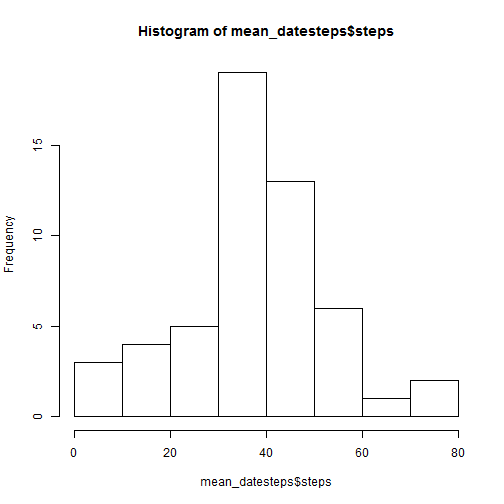
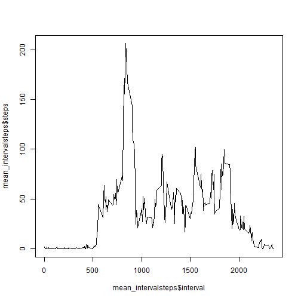

# Reproducible Research: Peer Assessment 1


## Loading and preprocessing the data

```r
data <- read.csv("activity.csv")
```


## What is mean total number of steps taken per day?

```r
library(reshape2)
datesteps <- melt(data[, 1:2], id = c("date"), na.rm = TRUE)
mean_datesteps <- dcast(datesteps, date ~ variable, mean)
hist(mean_datesteps$steps)
```

 

```r
round(mean(mean_datesteps$steps), 6)
```

```
## [1] 37.38
```

```r
round(median(mean_datesteps$steps), 6)
```

```
## [1] 37.38
```


## What is the average daily activity pattern?

```r
library(reshape2)
intervalsteps <- melt(data[, c(1, 3)], id = c("interval"), na.rm = TRUE)
mean_intervalsteps <- dcast(intervalsteps, interval ~ variable, mean)
plot(x = mean_intervalsteps$interval, y = mean_intervalsteps$steps, type = "l")
```

 

```r
which(mean_intervalsteps$steps == max(mean_intervalsteps$steps))
```

```
## [1] 104
```


## Imputing missing values


## Are there differences in activity patterns between weekdays and weekends?
