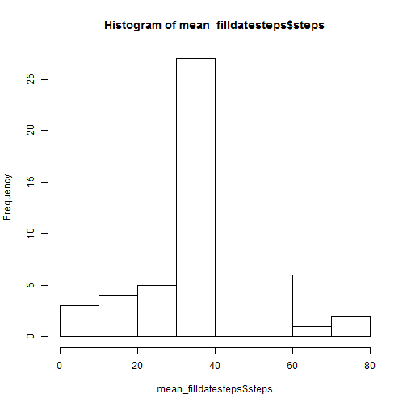

# Reproducible Research: Peer Assessment 1


## Loading and preprocessing the data

```r
data <- read.csv("activity.csv", stringsAsFactors = FALSE)
```


## What is mean total number of steps taken per day?

```r
library(reshape2)
datesteps <- melt(data[, 1:2], id = c("date"), na.rm = TRUE)
mean_datesteps <- dcast(datesteps, date ~ variable, mean)
hist(mean_datesteps$steps)
```

 

```r
mean(mean_datesteps$steps)  # the mean total number of steps taken per day
```

```
## [1] 37.38
```

```r
median(mean_datesteps$steps)  # the median total number of steps taken per day
```

```
## [1] 37.38
```


## What is the average daily activity pattern?

```r
library(reshape2)
intervalsteps <- melt(data[, c(1, 3)], id = c("interval"), na.rm = TRUE)
mean_intervalsteps <- dcast(intervalsteps, interval ~ variable, mean)
plot(x = mean_intervalsteps$interval, y = mean_intervalsteps$steps, type = "l")
```

 

```r
# the maximum number of steps
mean_intervalsteps$interval[which(mean_intervalsteps$steps == max(mean_intervalsteps$steps))]
```

```
## [1] 835
```


## Imputing missing values

```r
sum(is.na(data$steps) == TRUE)  # the total number of missing values
```

```
## [1] 2304
```

```r
# Create a New data set
filldata <- data
# Devise a strategy 'mean for that 5-minute interval' for filling in all of
# the missing values in the dataset.
for (i in 1:length(filldata$steps)) {
    if (is.na(filldata$steps[i]) == TRUE) {
        if (filldata$interval[i] %in% mean_intervalsteps$interval) {
            filldata$steps[i] <- mean_intervalsteps$steps[which(mean_intervalsteps$interval == 
                filldata[i, 3])]
        }
    }
}
# show the head of new data set
head(filldata)
```

```
##     steps       date interval
## 1 1.71698 2012-10-01        0
## 2 0.33962 2012-10-01        5
## 3 0.13208 2012-10-01       10
## 4 0.15094 2012-10-01       15
## 5 0.07547 2012-10-01       20
## 6 2.09434 2012-10-01       25
```

```r
filldatesteps <- melt(filldata[, 1:2], id = c("date"), na.rm = TRUE)
mean_filldatesteps <- dcast(filldatesteps, date ~ variable, mean)
hist(mean_filldatesteps$steps)
```

 

```r
# the new mean total number of steps taken per day
mean(mean_filldatesteps$steps)
```

```
## [1] 37.38
```

```r
# the new median total number of steps taken per day
median(mean_filldatesteps$steps)
```

```
## [1] 37.38
```

These values **DO NOT** differ from the estimates from the first part of the assignment. 
Thus, there is **NO BIG IMPACT** of imputing missing data on the estimates of the total daily number of steps.

## Are there differences in activity patterns between weekdays and weekends?

```r
filldata$date <- weekdays(as.Date(filldata$date))
for (i in 1:length(filldata$date)) {
    if (filldata$date[i] != "Sunday" & filldata$date[i] != "Saturday") {
        filldata$date[i] <- "weekday"
    } else {
        filldata$date[i] <- "weekend"
    }
}
# reshape the data to calculate the average steps
library(reshape2)
filldaysteps <- melt(filldata, id = c("date", "interval"), na.rm = TRUE)
mean_filldaysteps <- dcast(filldaysteps, interval + date ~ variable, mean)
head(mean_filldaysteps)
```

```
##   interval    date   steps
## 1        0 weekday 2.25115
## 2        0 weekend 0.21462
## 3        5 weekday 0.44528
## 4        5 weekend 0.04245
## 5       10 weekday 0.17317
## 6       10 weekend 0.01651
```

```r
# Make a panel plot
library(lattice)
mean_filldaysteps <- transform(mean_filldaysteps, date = factor(date))
xyplot(steps ~ interval | date, data = mean_filldaysteps, layout = c(1, 2), 
    type = "l", ylab = "number of steps")
```

 

